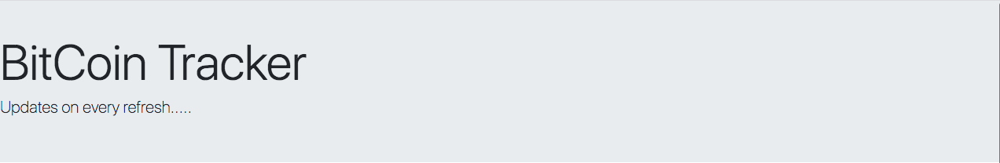
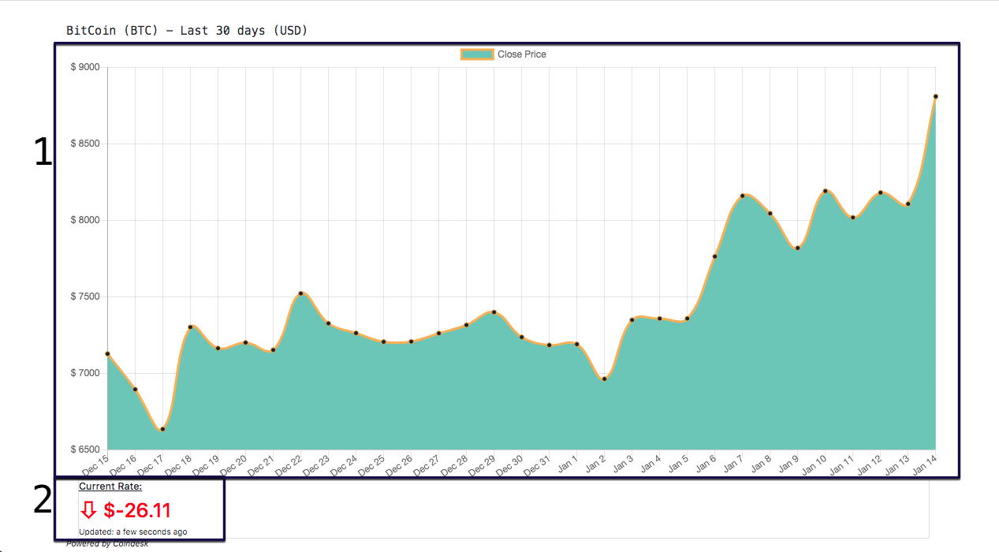

# BitCoin Tracker

### Tool for tracking BTC market

### 30 day graph and current status
*- The most recent rate persists in local storage. It will be available for comparison even if you leave the page. *

### Getting started -

###### Install dependancies ->
```
$ npm install
```

###### Start server ->
```
$ npm start
```

-- Server will start on port 3000.

-- Navigate to http://localhost:3000 to check BTC rates.

###### Layout ->




1. 30 day graph
 -- Show the rate at closing time for the last 30 days.

2. Current rate
 -- Displays the current rate and the difference between the most recent rate.

###### Built with ->
- React
- Babel/Webpack
- Bootstrap
- Express
- CoinDesk API
